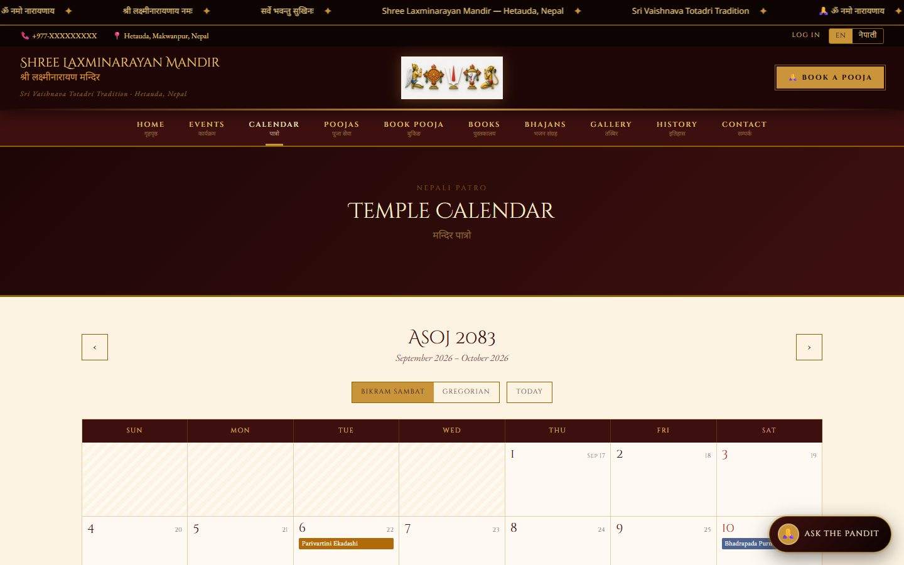
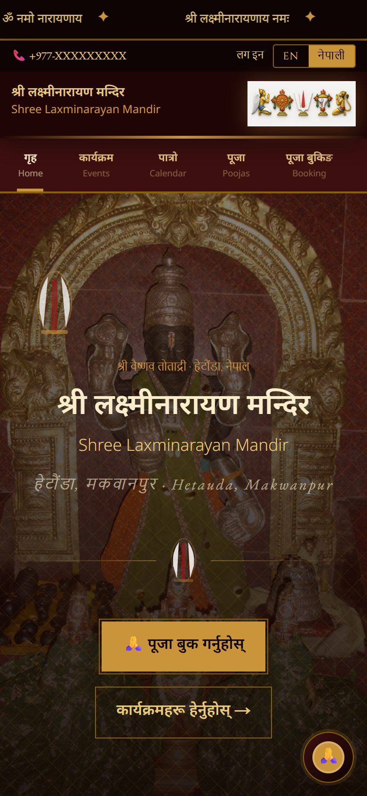
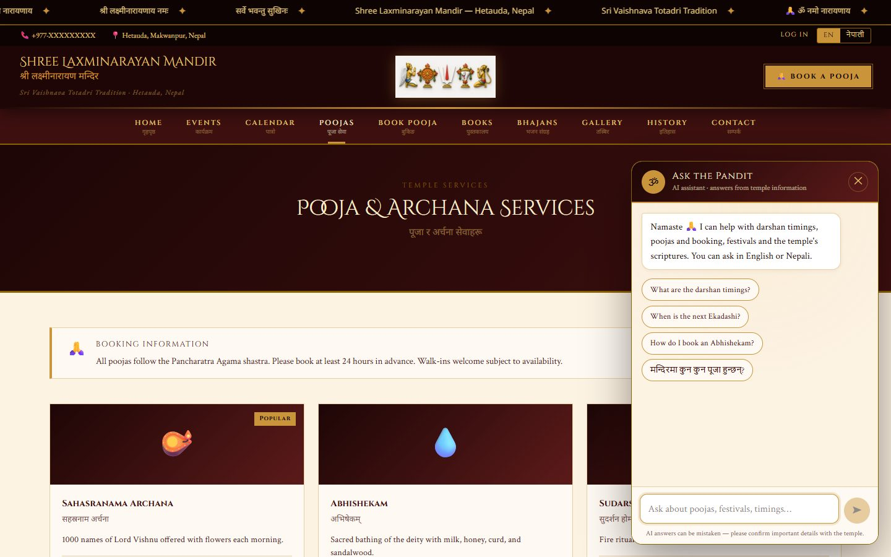
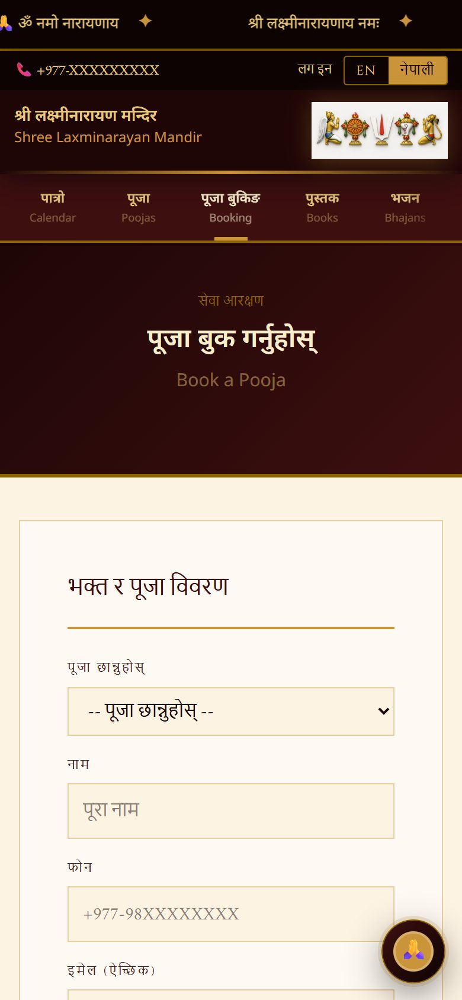
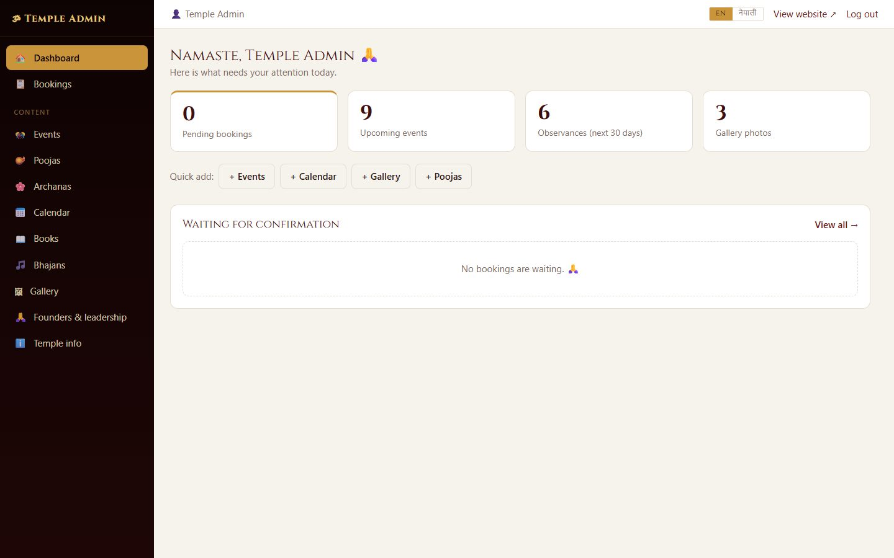
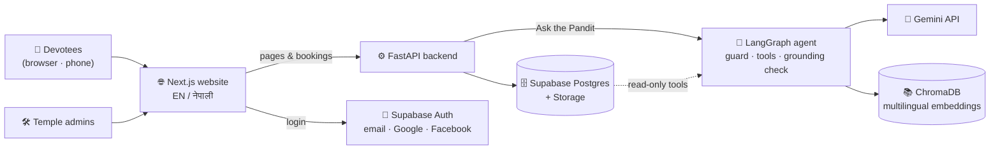

<div align="center">


# श्री लक्ष्मीनारायण मन्दिर
## Shree Laxminarayan Mandir · Hetauda, Nepal

**The official bilingual website and temple-management platform**
*Sri Vaishnava · Totadri tradition*

ॐ नमो नारायणाय 🙏

<br>


</div>

---

<p align="center">
  
</p>

## 🛕 About

This platform serves a **real, living temple**: Shree Laxminarayan Mandir in Hetauda, Makwanpur. It gives devotees one place to find darshan timings, festivals and the temple calendar, to **book poojas online**, read sacred texts, listen to bhajans, and ask questions in **English or Nepali**. Temple volunteers manage everything from a simple dashboard, with no coding needed.

Every page, button, date and number works in both languages. Nepali pages use Devanagari numerals (०१२३), Nepali month names, and the **Bikram Sambat** calendar.

## ✨ Features

### For devotees

| | |
|---|---|
| 🪔 **Pooja & archana services** | Every offering with its price, duration and description |
| 📅 **Online pooja booking** | Choose a seva, date and time, plus gothram, nakshatra and rashi. Goes straight to the temple's inbox |
| 🗓 **Temple calendar (पात्रो)** | A month-by-month Bikram Sambat / Gregorian calendar of festivals, Ekadashi, Purnima, Sankranti and special poojas, with today highlighted |
| 🎉 **Events** | Upcoming festivals and programmes, filterable by type |
| 🖼 **Photo gallery** | Category filters and a full-screen lightbox with swipe and keyboard support |
| 📚 **Sacred library** | Scriptures and books, with PDFs to read online |
| 🎵 **Bhajans** | A built-in audio player for devotional songs |
| 📜 **History** | The temple's founders and current leadership |
| 🤖 **Ask the Pandit** | An AI assistant that answers questions about timings, rituals, festivals and booking, **only from the temple's own information**, in the language you ask in |
| 👤 **Accounts** | Email/password, Google or Facebook sign-in; password reset with a 6-digit code |

### For temple administrators

| | |
|---|---|
| 📥 **Bookings inbox** | Pending / Confirmed / Completed / Cancelled tabs, one-tap confirm or cancel, internal notes, tap-to-call |
| ✏️ **Content management** | Add, edit or hide events, poojas, archanas, calendar entries, books, bhajans, photos, founders and temple info, with English and Nepali side by side |
| ⬆️ **Uploads** | Photos, book PDFs and bhajan audio upload straight to secure storage |
| ⚡ **Instant updates** | Changes appear on the public site immediately |
| 🔐 **Role-based access** | Only accounts promoted to `admin` can open the dashboard; the database enforces this too |

## 📸 Screenshots

<table>
  <tr>
    <td width="66%"><br><sub><b>Temple calendar:</b> Bikram Sambat months with Gregorian dates alongside</sub></td>
    <td width="34%"><br><sub><b>नेपाली, on a phone</b></sub></td>
  </tr>
  <tr>
    <td><br><sub><b>Ask the Pandit:</b> the AI assistant on every page</sub></td>
    <td><br><sub><b>Pooja booking</b> (नेपाली)</sub></td>
  </tr>
  <tr>
    <td><br><sub><b>Gallery</b> with category filters</sub></td>
    <td><br><sub><b>Admin dashboard</b></sub></td>
  </tr>
</table>

## 🏗 How it fits together



- **Website** (`frontend/`): Next.js App Router with server-side rendering, so pages load fast even on slow mobile connections. A hand-built maroon & gold design system (no UI kit), using the Cinzel, Crimson Text and Noto Sans Devanagari fonts.
- **Backend** (`backend/`): a FastAPI REST API. All writes require a verified admin token; bookings are validated server-side.
- **Database** (`database/`): one idempotent schema file with Row Level Security on every table.
- **AI** (`ai-services/`): temple content and PDFs are chunked and embedded with the multilingual `intfloat/multilingual-e5-small` model, then stored in ChromaDB. Each question goes to a **tool-calling LangGraph agent**: Gemini chooses among five read-only tools (knowledge-base search, calendar, pooja prices, temple info, booking help), then answers *only* from what they returned, citing each passage — and a grounding check sends it back if it answered from its own memory instead. The API key stays on the server; conversations are saved to `chat_history`. See [`docs/AGENT.md`](docs/AGENT.md).

## 🧰 Tech stack

| Layer | Technology |
|---|---|
| Frontend | Next.js 16 (App Router) · React 19 · TypeScript · next-intl (`en`, `ne`) · plain CSS design tokens |
| Backend | FastAPI · Pydantic v2 · Python 3.13 |
| Database | PostgreSQL on Supabase · Row Level Security |
| Auth | Supabase Auth: email + password, 6-digit OTP reset, Google & Facebook OAuth (PKCE) |
| Storage | Supabase Storage: `gallery`, `book-pdfs`, `bhajan-audio`, `site-media` |
| AI | Google Gemini (`gemini-2.5-flash`) · LangGraph agent · ChromaDB · sentence-transformers |
| Hosting (recommended) | Vercel (website) · Render (API) · Supabase (data) |

## 🚀 Getting started

> **👉 Setting this up for the first time? Follow [`MANUAL_STEPS.md`](MANUAL_STEPS.md).**
> It's a step-by-step checklist covering Supabase, API keys, Google/Facebook login, making yourself admin, and going live.

Once your keys are in place (`backend/.env`, `frontend/.env.local`; see the `.env.example` files), run it locally in three terminals.

**Windows (PowerShell):**

```powershell
# 1 · Backend API  →  http://localhost:8000/docs
cd backend
python -m venv venv; venv\Scripts\Activate.ps1
pip install -r requirements.txt
uvicorn app.main:app --reload

# 2 · Build the AI knowledge base (re-run whenever content changes)
cd backend; venv\Scripts\Activate.ps1
python ../ai-services/scripts/ingest.py

# 3 · Website  →  http://localhost:3000
cd frontend
npm install
npm run dev
```

**Linux / macOS (bash):**

```bash
# 1 · Backend API  →  http://localhost:8000/docs
cd backend
python3 -m venv venv && source venv/bin/activate
pip install -r requirements.txt
uvicorn app.main:app --reload

# 2 · Build the AI knowledge base (re-run whenever content changes)
cd backend && source venv/bin/activate
python ../ai-services/scripts/ingest.py

# 3 · Website  →  http://localhost:3000
cd frontend
npm install
npm run dev
```

> The `pip install -r requirements.txt` must be run **from `backend/`** — the file
> installs the sibling RAG package with the relative path `-e ../ai-services`.

## 📁 Project structure

```
temple-platform/
├── frontend/                 Next.js website
│   ├── src/app/[locale]/
│   │   ├── (site)/           public pages: home, events, calendar, poojas, books, bhajans, gallery, history, contact
│   │   ├── (auth)/           login, signup, forgot / reset password
│   │   └── (admin)/admin/    admin dashboard + bookings inbox
│   ├── src/components/       UI components (incl. chat/PanditChat)
│   ├── src/messages/         en.json + ne.json (every visible string)
│   └── src/lib/              API client, auth actions, Nepali number/date formatting
├── backend/                  FastAPI app (routers, schemas, admin auth) + tests
├── ai-services/              temple_rag package: ingestion, retrieval, LangGraph agent
│   ├── evals/                40-case eval harness for the agent
│   └── knowledge_base/       drop extra temple PDFs / notes here
├── database/                 schema_v2.sql, seed.sql, seed_calendar.sql (+ calendar generator)
├── docs/screenshots/         images used in this README
├── AUDIT.md                  code audit and every fix made since
└── MANUAL_STEPS.md           setup & deployment guide
```

## 🧪 Testing

**Windows (PowerShell):**

```powershell
cd backend; venv\Scripts\Activate.ps1
python -m pytest                      # API tests
python -m pytest ../ai-services/tests # RAG pipeline tests (offline; mocked model API)
cd ..\frontend; npx tsc --noEmit; npx eslint src
```

**Linux / macOS (bash):**

```bash
cd backend && source venv/bin/activate
python -m pytest                      # API tests
python -m pytest ../ai-services/tests # RAG pipeline tests (offline; mocked model API)
cd ../frontend && npx tsc --noEmit && npx eslint src
```

> Run the two test suites as two separate commands, not as one `pytest` over the
> whole repo: `backend/tests/` is an importable package named `tests`, so
> collecting both directories at once would clash on that name.

Each phase was also checked end-to-end in Chrome, in both languages, at phone and desktop sizes: page loads with zero console errors, the auth flows, the admin flows, the chat widget, and horizontal overflow at 390 px.

## 🌏 Bilingual by design

- Every user-facing string lives in `frontend/src/messages/en.json` and `ne.json`. **No page has English-only text.**
- Nepali numbers and dates use our own formatter (`src/lib/format.ts`), because browsers lack Nepali number data. Server and browser always agree.
- Content in the database has `_en` and `_ne` columns; admins fill in both.
- "Ask the Pandit" replies in whichever language the question was asked in.

## 🙏 Contributing

This is a seva (service) project for the temple. Suggestions, bug reports and translation fixes are welcome. Please open an issue or contact the temple administration.

## 📄 License

Private. © Shree Laxminarayan Mandir, Hetauda, Nepal. All rights reserved.

<div align="center">
<br>
<b>सर्वे भवन्तु सुखिनः</b><br>
<i>May all beings be happy</i>
</div>
