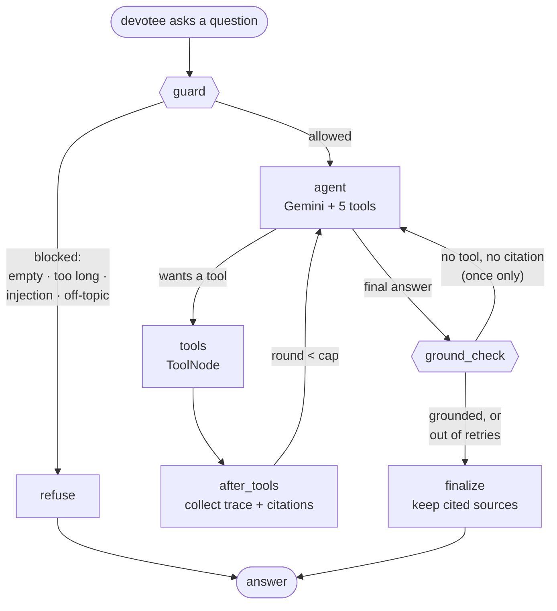

# "Ask the Pandit" — how the agent works

The chat widget on the temple website is a **tool-calling agent**. It does not
get handed a pile of text and asked to answer. Instead the model is given five
tools, decides which to call, reads what comes back, and answers only from that.

Code: [`ai-services/temple_rag/assistant.py`](../ai-services/temple_rag/assistant.py)
(the graph) and [`tools.py`](../ai-services/temple_rag/tools.py) (the tools).

---

## The graph



| Node | What it does |
|---|---|
| `guard` | Pure regex. Rejects empty input, anything over 1000 characters, obvious prompt injection, and blatantly off-topic questions (sport, elections, crypto, coding, horoscopes, medical). **No model call**, so a blocked question costs nothing. |
| `agent` | Gemini with the five tools bound. Returns either tool calls or a final answer. |
| `tools` | LangGraph's `ToolNode` runs the requested calls. A follow-up node harvests the trace and the citation list. |
| `ground_check` | If the answer has no tool call *and* no `[n]` citation, the model answered from its own memory instead of the temple's records. Nudge it once; if it does the same again, return the honest "I don't have that information" reply. |
| `finalize` | Keep only the sources the answer actually cited, and total the token usage. |
| `refuse` | The existing refusal text, in the devotee's language. No model call. |

## The tools

All five are **read-only**. None can insert, update or delete, none touches
`profiles`, `pooja_bookings`, `chat_history` or `auth.users`, and every one
filters on its table's own visibility flag so an unpublished draft is never
quoted. Table and column names come from `database/schema_v2.sql`.

| Tool | Reads | Answers questions like |
|---|---|---|
| `search_temple_knowledge` | ChromaDB (the ingested knowledge base) | history, tradition, scriptures, the meaning of a ritual. The **fallback**, not the first choice. |
| `get_calendar_events` | `calendar_events` | "which festival is on 21 October?", "भोलि कुन पर्व छ?" Returns Gregorian + Bikram Sambat dates and the tithi. |
| `get_pooja_info` | `poojas`, `archanas` | "how much is Abhishekam?", "how long does it take?" |
| `get_temple_info` | `temple_info` | timings, address, phone, email, dress code, footwear, booking policy. **Authoritative** — quoted exactly. |
| `get_booking_help` | static steps + `temple_info` policy | "how do I book?" It explains the steps; it **cannot** book. |

Every argument is validated and clamped: date ranges to 90 days, strings to 100
characters, results to 25 rows. Every tool catches its own errors and returns a
short sentence, so one unavailable table cannot take the chat down.

---

## Why it's built this way

**Why a custom `StateGraph` instead of `create_react_agent`?**
The prebuilt helper is one line, but it is a black box: you cannot see where a
refusal happened, or add a step that checks the answer before it reaches a
devotee. Writing the graph out means every decision has a name and a log line,
the guard and grounding steps have somewhere to live, and each node can be
tested on its own. For a temple site where a wrong answer about a festival date
matters, being able to explain the path an answer took is worth the extra code.

**Why cap the tool rounds?**
A model that keeps searching, never satisfied, would spend tokens forever and
leave the devotee watching a spinner. The cap is four rounds, after which the
agent answers with what it has. LangGraph's `recursion_limit` is set as a
backstop, but the cap is enforced in the routing function so the agent stops
*gracefully* rather than by raising. One subtlety: when the cap is hit, the last
message still contains tool calls that were never run, and the Gemini API
rejects a conversation containing a function call with no matching response — so
that path must not send the conversation back to the model, and it doesn't.

**Why a guard node?**
Two reasons, one about cost and one about honesty. Cost: "who won the World
Cup?" shouldn't reach a paid API at all, and the guard answers it for free.
Honesty: the refusal wording is fixed and translated, so an off-topic question
gets the same courteous reply every time rather than whatever the model improvises.
The guard is deliberately **narrow** — the system prompt handles ordinary
off-topic questions gracefully, and a wrongly blocked question is worse than a
model-handled refusal. For example `राशिफल` (horoscope) is blocked but `राशि`
is not, because rashi is a real field on the pooja booking form.

**Why read-only tools?**
The assistant is a public, unauthenticated endpoint that anyone can type into.
If a tool could write, a devotee could talk it into creating or cancelling
bookings; if a tool could read `pooja_bookings`, they could ask after someone
else's phone number. Keeping every tool read-only and scoped to public content
means the worst a hostile visitor achieves is reading the website's own text
back to themselves. The booking tool returning *instructions* rather than
performing the booking is the same principle.

**Why keep multilingual-e5 embeddings and ChromaDB?**
They already work. The e5 model handles Nepali and English in one vector space —
measured on this temple's data, relevant passages score ≥ 0.815 while off-topic
questions land at 0.74–0.79, in both languages, which is a comfortable margin
for the 0.80 threshold. It runs on CPU for free with no second API key. Google
does offer a hosted embeddings endpoint, but switching would mean re-embedding
the whole index and re-tuning that threshold for no measured gain. The engine
changed; the retrieval layer had no reason to.

---

## Evaluation

`ai-services/evals/` holds 40 hand-written cases (`cases.jsonl`): 12 English
facts, 12 Nepali facts, 6 calendar, 5 pooja price/booking, 5 off-topic or
injection. Every expected answer comes from `database/seed.sql` and
`database/seed_calendar.sql` — nothing is invented. Two properties of the seed
data the cases respect: `contact.phone` is still the placeholder
`+977-XXXXXXXXX`, so no case asserts on a phone number; and `events` rows are
seeded at `current_date + N`, so only `calendar_events` dates are stable enough
to assert on. `python evals/seed_fixture.py` re-reads the SQL and reports drift.

```bash
cd backend && source venv/bin/activate     # or: venv\Scripts\Activate.ps1

# offline — no API key, no network, no cost
python ../ai-services/evals/run_evals.py --offline

# online — the real measurement. Needs GOOGLE_API_KEY.
python ../ai-services/evals/run_evals.py
```

Results land in `evals/results/latest.json` and `latest.md`.

### Offline results

<!-- These are the numbers run_evals.py --offline actually printed. -->

| Metric | Value |
|---|---|
| Cases | 40 |
| Passed | 40 (100%) |
| Tool selection | 100% |
| Answer contains | 100% |
| Refused when it should | 100% |
| Wrongful refusals | 0 |
| Citation rate | 8.6% |
| Avg latency | 11 ms |
| Avg tokens | 175 in / 35 out (synthetic) |
| Errored | 0 |

> **Read this before quoting those numbers.** Offline mode replaces Gemini with
> a keyword-matching stand-in (`temple_rag/fake_model.py`) and Supabase with an
> in-memory fixture, and uses the non-semantic `hash` embedder. It therefore
> measures **the harness and the graph, not the model's judgement**: 100% tool
> selection means a hand-written `if` statement matched a hand-written case.
> Latency and token counts are synthetic. The low citation rate is expected —
> the stand-in mostly calls the database tools, which return facts without
> numbered passages. Treat offline as a regression gate: it should stay at
> 40/40, and anything less means something genuinely broke.

### Online results

**Not yet measured.** Running the suite against the real Gemini API needs a
`GOOGLE_API_KEY`, a Supabase project with the seed data loaded, and an ingested
ChromaDB index — none of which were available where this was built. Rather than
publish estimates, this section is left empty until someone runs:

```bash
cd backend && source venv/bin/activate
python ../ai-services/scripts/ingest.py          # build the index first
python ../ai-services/evals/run_evals.py         # ~4 min with the rate-limit pause
```

and pastes the table from `evals/results/latest.md` here. The runner spaces
cases 4 seconds apart and retries a 429 with exponential backoff and jitter, so
a full 40-case sweep stays inside the Gemini free-tier rate limit.

### Quick manual check

`python ../ai-services/scripts/smoke_chat.py` asks three live questions (English
timings, a Nepali calendar question, and an off-topic one that must be refused)
and prints the answer, sources, tools and token usage for each. Exit code 0 when
all three behave, so it works as a deployment gate.

---

## Logging and tracing

At `INFO`, one line per step: the guard's decision and reason category; the
agent's latency, input/output tokens and which tools it asked for; each tool's
name, success, latency and **argument sizes** (never their contents); and
finalize's citation and round counts. No devotee text and no key material is
ever logged.

Optional [LangSmith](https://smith.langchain.com) tracing is off by default and
turns on only when `LANGSMITH_API_KEY` is set, in which case the agent also sets
`LANGSMITH_TRACING=true` and a project name of `ask-the-pandit`. It is useful for
seeing a slow or confused run step by step. Note that enabling it sends prompts
and tool results to LangSmith, so leave it off in production unless you have
decided that's acceptable.
